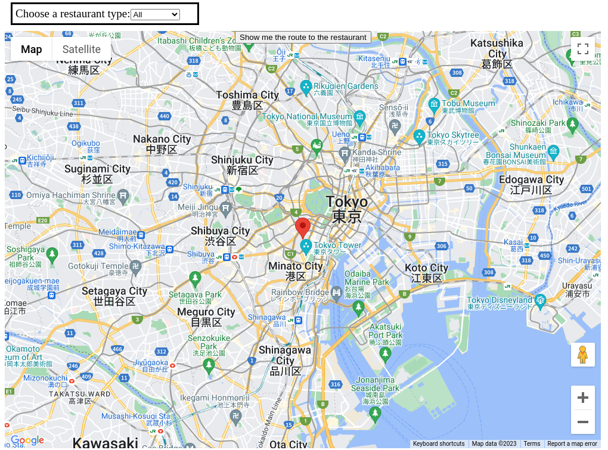

# Restaurant Map 

## - How to start the server - 
1. Change the API key of the script tag inside the index.html
2. Make sure you allow Google Maps Place, Direction, JavaScript API in the Google Maps Platform
2. npm install in the root directory
3. npm run dev in the root directory
4. Go to http://localhost:5174/ from your browser

## - Features -

### a. View the locations on the map
- You can see the pins of the restaurants on the google map when you access to the page(url).

### b. See for more information of the restaurant
- By clicking the pin, you can see for more information of the restaurant.

### c. Changing the category of the restaurant
- At the top left, there is a drop down button that you can choose what type of restaurant to display on the map.

### d. The route to the restaurant from the current location
- At the top middle inside the map, there is a button that shows that route to the restaurant from the current location.

## - Major Libraries -

- Google Maps API
- Vue 3
- Vite

## why you chose the methods
- Vite and VueJS is light-weight Front End tool. It can build a project very fast, flexibly, and easily.
- Seperating the file with the code of Google maps API and using JavaScript module makes much cleaner to file structure.

## where you see limitations
Restaurant type

## how you would improve the application in the future.
- The route function should be able to specify which restaurant the user want to be navigated to.
- More beatiful layout and buttons.
- 
